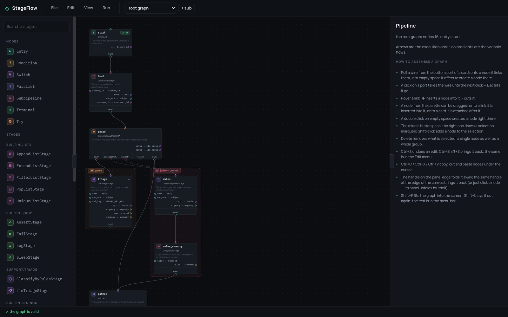
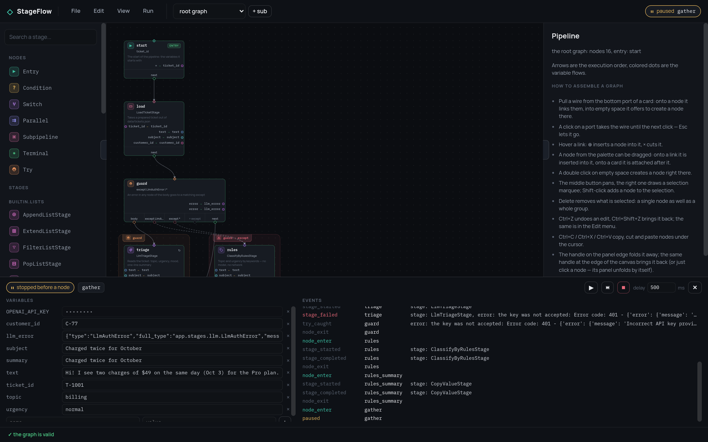

<div align="center">

# StageFlow Editor

**Draw a pipeline, run it on the real core, watch it go node by node.**

[](https://github.com/leo-need-more-coffee/stageflow-ui/releases)
[](LICENSE)
[](package.json)
[](package.json)

[Try it](https://leo-need-more-coffee.github.io/stageflow-ui/) ·
[Core](https://github.com/leo-need-more-coffee/stageflow) ·
[Example backend](https://github.com/leo-need-more-coffee/stageflow-example) ·
[Documentation](https://leo-need-more-coffee.github.io/stageflow/)

</div>



A visual editor for [StageFlow](https://github.com/leo-need-more-coffee/stageflow)
pipelines. Plain HTML and ES modules: no build step, no framework, no
dependencies.

The editor holds no stages and executes nothing. It asks a StageFlow backend
for the stage specifications, draws the graph from them, and sends runs back
to that backend. So what the debugger shows is the core's own semantics, not a
second implementation of them in JavaScript.

## Run it

```bash
npm start                      # http://127.0.0.1:8080
```

or:

```bash
docker compose up --build      # http://127.0.0.1:8080
```

Then type the address of a backend on the connection screen — for example
`http://127.0.0.1:8765` if you are running the
[example](https://github.com/leo-need-more-coffee/stageflow-example). The
address is remembered, and `?backend=http://host:port` in the URL skips the
question.

`server.js` is a hundred lines of static file serving with no dependencies:
ES modules cannot be loaded from `file://`, so the page has to come over http.
`PORT` and `HOST` come from the environment (`UI_PORT` in compose).

## What it does

- **The graph is built on the canvas.** Pull a wire from a port onto a node to
  link them, or into empty space to create one there. `⊕` and `×` on a link
  insert and cut. A node dragged from the palette lands on a link or after a
  card. Every way of adding a node ends with a connection.
- **Two kinds of connector on two axes.** Execution order runs vertically and
  is the real `next` of the JSON; data flows run horizontally, are derived from
  the graph, and are coloured per variable.
- **Regions are derived, not drawn.** The branches of a `parallel`, the body
  and handlers of a `try`, the body of a `map` loop are framed from the
  structure of the graph, so a frame cannot disagree with it.
- **The inspector comes from the stage spec.** Forms instead of hand-written
  JSON, with unfilled required arguments marked.
- **Step debugging on the real core**: the current node on the graph, stepping,
  a pace between nodes, and frame variables you can read and edit mid-run.
- **Secrets stay out of the JSON.** Only the name of a key goes into the
  pipeline; values live in the store and never appear in the debug panel or
  the event log.
- Subpipelines, live validation, JSON import and export, undo/redo, a node
  clipboard, and a session that survives a reload.



## Compatibility

The editor mirrors the core's node registry as it stood when the editor was
built, so an editor newer than the backend it is pointed at is the normal
case. It is not guessed from version numbers — the backend is asked:

```
GET /api/meta  ->  {"api": 1, "stageflow": "0.10.0", "node_types": [...], "stages": 26}
```

`node_types` is the core's registry. A type missing from it is greyed out in
the palette with the reason in the tooltip, and a graph already using one says
so in the status bar **before** a run rather than failing halfway through it
with `Unknown node type`. The status bar carries the pair, `editor 0.2.0 ·
core 0.10.0, api v1`.

A backend that serves no `/api/meta` — an older one, or somebody else's — is
not second-guessed: nothing is marked and everything works as before, because
a false "unsupported" would be worse than the error being avoided. The status
bar says the version is unknown.

| Editor | Speaks | Needs |
|---|---|---|
| 0.2.x | api v1 | any StageFlow backend; core ≥ 0.10 to offer the `map` node and to be asked at all |

## Releases

A tag builds two things (`.github/workflows/release.yml`): a GitHub Release
with the static files zipped, and an image in GHCR.

```bash
docker run --rm -p 8080:8080 ghcr.io/leo-need-more-coffee/stageflow-ui:latest
```

The hosted demo at
[leo-need-more-coffee.github.io/stageflow-ui](https://leo-need-more-coffee.github.io/stageflow-ui/)
is the same files, deployed from `main`. It is served over https, so the
backend address you give it has to be reachable from a secure page: a local
backend works in Chrome (the example backend answers the private-network
preflight), but a browser that blocks it will simply report the backend as
unreachable — then run the editor locally, which is one command anyway.

The version lives in two places, `package.json` and `js/version.js` (the
browser cannot read the first, nothing rewrites the second — there is no build
step); `npm test` fails if they disagree, and so does the release workflow if
the tag does not match both.

## Documentation

| Page | What it covers |
|---|---|
| [The backend](docs/backend.md) | the endpoints the editor needs, CORS, the shape of a stage spec |
| [Building a graph](docs/canvas.md) | connectors, mouse gestures, regions, auto-layout |
| [The interface](docs/interface.md) | menus and hotkeys, the inspector, the theme, the session |
| [Running and debugging](docs/running.md) | the run pace, starting variables, the debug panel, the run API |
| [Secrets](docs/secrets.md) | where keys live and why they are not in the pipeline |
| [Embedding](docs/embedding.md) | `createEditor` options, the public API, the layout of `js/` |

## Tests

Plain node scripts, no framework:

```bash
npm test
```

They cover what the eye misses: that every node kind has a port for the next
node, that inserting into an edge keeps the tail of the graph, that 291 random
layouts produce no overlaps and no foreign node inside a region frame, that
undo/redo walks real edits only, that pasted copies are independent, that
secret values never leave the store, and that an older backend is degraded
against rather than guessed about.

## Known limitations

A stage that waits for input (`wait_input`) cannot be answered from the UI
yet, and stepping is still one node at a time — there are no breakpoints.

## License

MIT — see [LICENSE](LICENSE).
